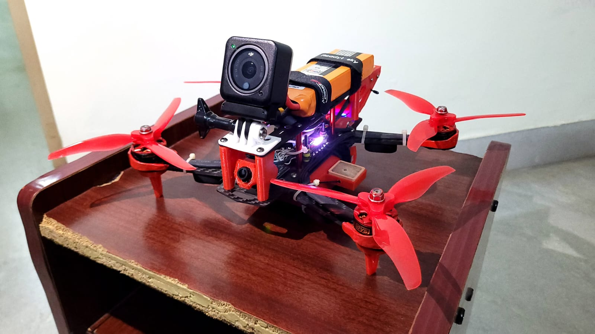
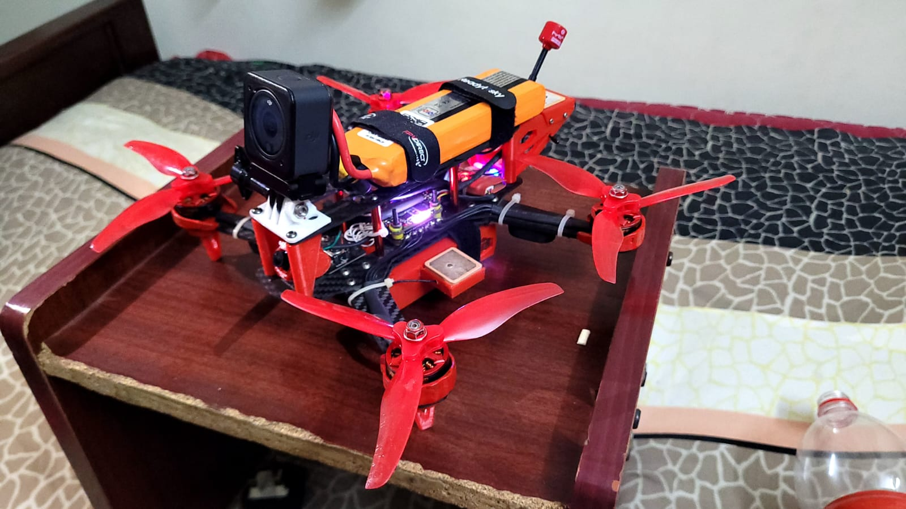
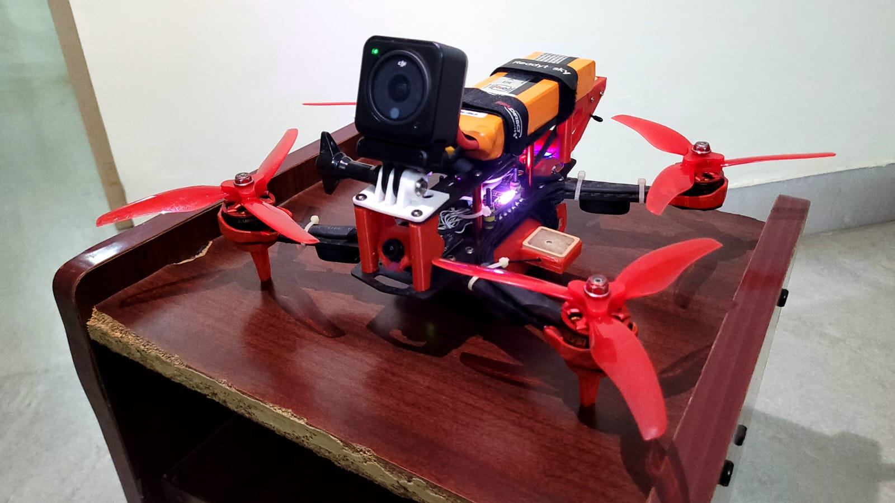
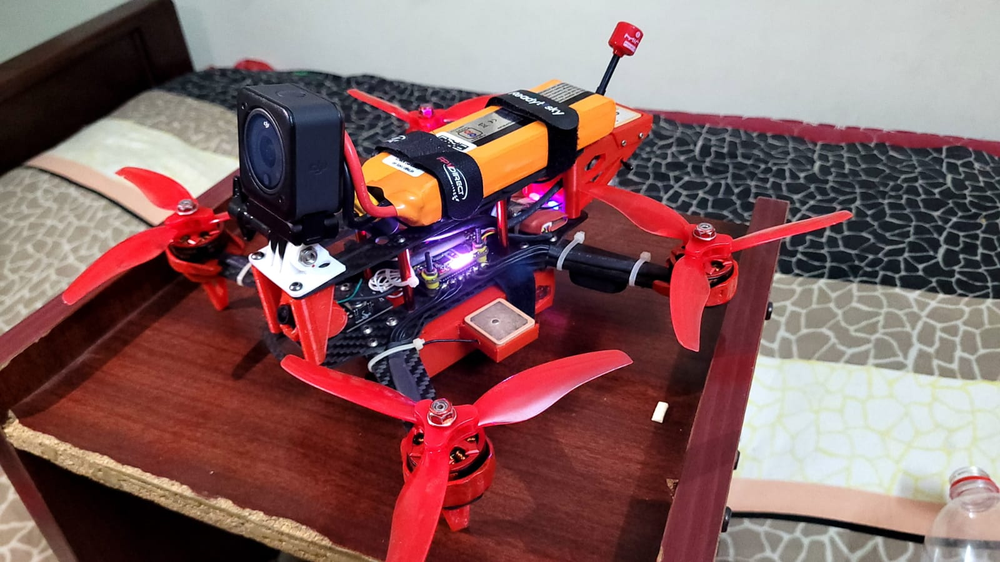

# AI Emergency Rescue Drone System

An AI-powered drone designed to assist women in emergency situations.  
The system identifies victims, streams live video, and alerts emergency responders.

## Features

- SOS mobile application
- AI victim identification
- Live drone camera streaming
- Emergency alert system
- GPS location support

## Technologies

- Raspberry Pi
- Python
- OpenCV
- Face Recognition
- Flask API

## Project Structure

drone_ai/ – AI modules and drone control  
drone_camera/ – camera streaming system  
mobile_app/ – Android SOS application  
docs/ – project documentation

## Running the Server

## Advanced AI Features

- Victim Face Recognition
- Real-time Threat Detection (YOLO)
- Victim Tracking
- Drone GPS Navigation
- Live Video Streaming

## AI Capabilities

- Face Recognition (Identify Victim)
- Threat Detection (YOLO)
- Emotion Detection (DeepFace)
- Victim Tracking
- Drone Navigation
- Live Video Streaming

## Project Images

### System Overview

### Drone Hardware

### Mobile App Interface

### Drone Camera Feed
